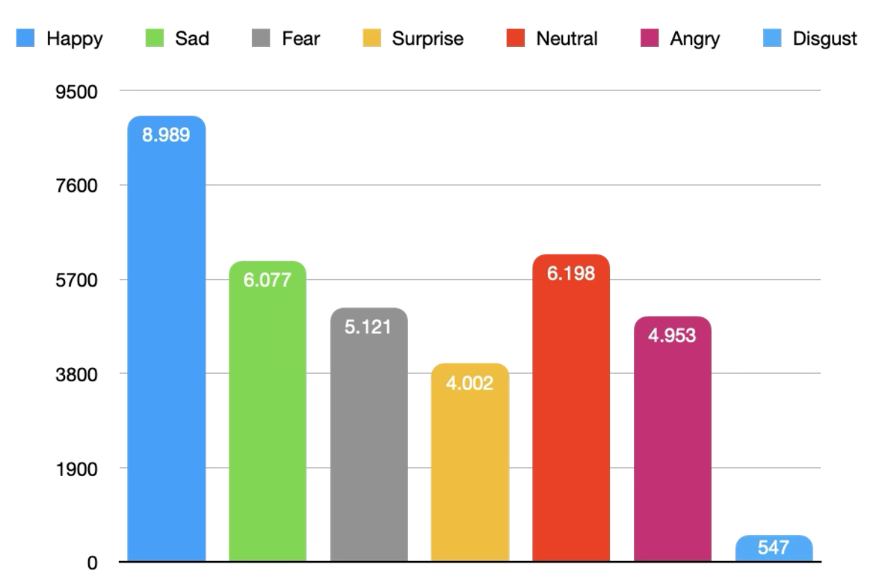
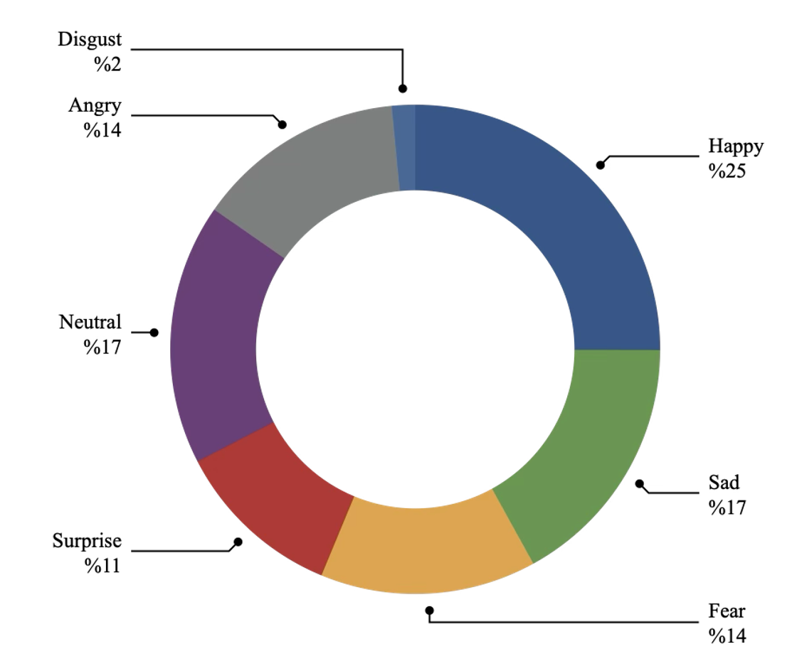
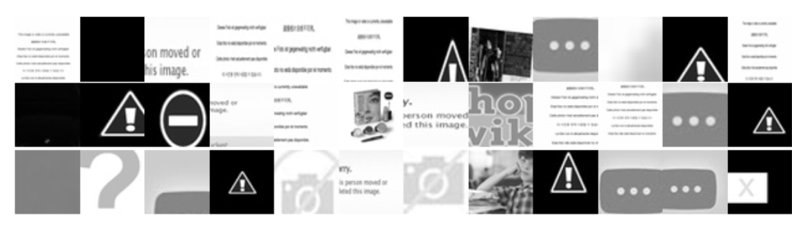
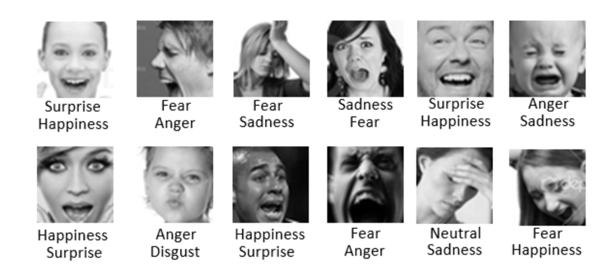
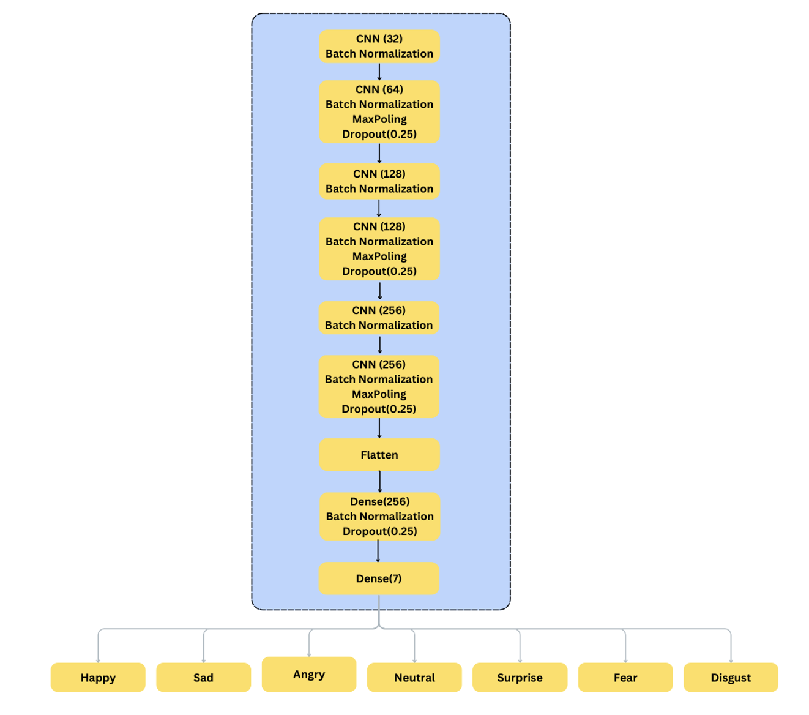
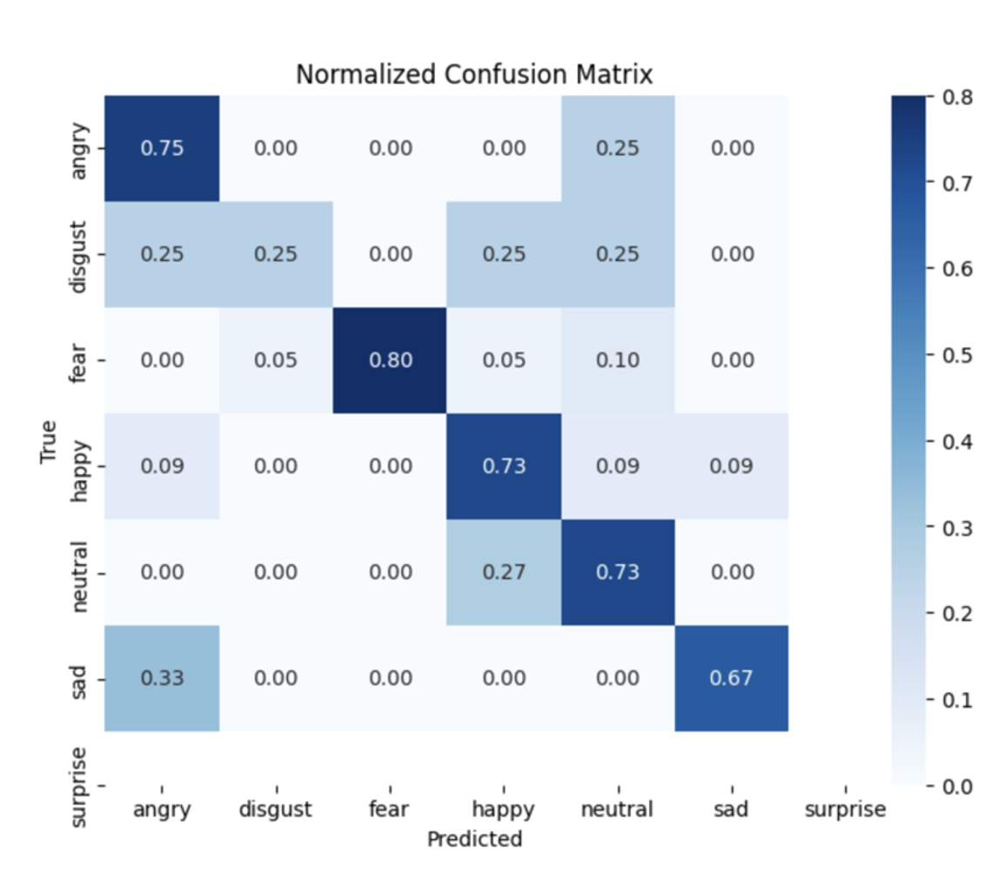
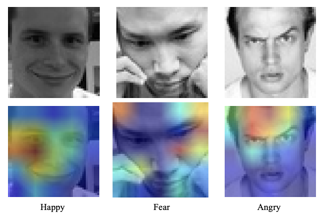

# Facial Emotion Recognition (FER) 🧠 

Facial Expression Recognition (FER) is a vital field in computer vision and affective computing, enabling automated identification of human emotions from facial cues. Applications span human-computer interaction, psychology, and security.
Early FER systems relied on handcrafted features (e.g., HOG) and classical classifiers like SVMs, which struggled with real-world variability. Recent advancements in deep learning—especially Convolutional Neural Networks (CNNs)—have significantly improved accuracy by learning rich, hierarchical features directly from data.
Datasets like CK+ and JAFFE have supported this progress, though challenges remain, including lighting variations, occlusions, and cultural differences. Techniques like data augmentation, domain adaptation, and temporal modeling are actively used to enhance robustness.
FER continues to evolve by integrating insights from machine learning, vision, and behavioral science to build systems that perform reliably in unconstrained environments.

# Dataset

The dataset FER-2013 comprises approximately 35,887 grayscale images, each resized to a resolution of 48×48 pixels, depicting facial expressions categorized into seven distinct emotion classes:

1.	Angry
2.	Disgust
3.	Fear
4.	Happy
5.	Sad
6.	Surprise
7.	Neutral.


 The dataset is divided into three subsets: a training set containing 28,709 images and a test set also comprising 7,178 images, allowing for a structured evaluation of machine learning models.

To provide a comprehensive overview, Table (1) and Figure (1) illustrate the distribution of images across the seven emotion classes within each subset.Figure (2) depicts the class weight across the FER-2013 dataset.




Despite its extensive use, FER-2013 includes certain limitations, such as annotation errors and low-resolution images, which can hinder model performance. Researchers have highlighted instances of mislabeling and inconsistent quality across samples. For instance, images with ambiguous expressions are sometimes incorrectly categorized, as depicted in the figure below which provides examples of mislabeled images.



The figure below also includes some non-face images. Such inconsistencies necessitate data cleaning and augmentation techniques to mitigate their impact on model accuracy.



## Preprocessing

Preprocessing ensures the FER-2013 dataset is optimized for training deep learning models. Key steps include:
	•	Resizing & Normalization: Images are resized to 48×48 pixels and normalized to [0, 1] for stable training.
	•	Channel Conversion: Grayscale images are converted to 3-channel RGB format for compatibility with CNNs.
	•	Data Augmentation: Techniques like rotation (±30°), horizontal flip, zoom (0.8–1.2×), and brightness variation improve generalization.
	•	Class Balancing: Class weights and oversampling address dataset imbalance, especially for underrepresented classes like “Disgust”.
	•	Batch Processing: Real-time preprocessing using ImageDataGenerator ensures memory efficiency during training.
	•	Validation: Preprocessed images were verified for shape, pixel intensity range, and format (RGB).


## 🧠 Model Architecture

The implemented Convolutional Neural Network (CNN) is designed for efficient and accurate emotion classification of grayscale images (48×48), categorizing them into seven emotions: Happy, Sad, Angry, Neutral, Surprise, Fear, and Disgust.



## Results

The model achieved accuracy of 70.13% .The normalized confusion matrix reveals the model’s strengths and limitations in emotion classification.



Grad-CAM visualizations for the emotions "Happy," "Fear," and "Angry," highlighting the areas of the image that the model focuses on during its predictions. The heatmaps, overlaid on the original images, show that the model primarily attends to critical facial regions such as the eyes, mouth, and eyebrows, which are essential for distinguishing emotions. For "Happy," the model emphasizes the smile, while for "Fear," it focuses on the furrowed brows and tense facial features. Similarly, the "Angry" heatmap highlights the intense gaze and tight mouth region. These visualizations provide interpretability, validating that the model's predictions align with human understanding of emotion-related facial expressions.



## Deployment 
The model has been successfully deployed utilizing a robust stack of technologies, ensuring both performance and scalability:
- Flask: A lightweight web framework for building and managing the API.
- JavaScript: To provide dynamic and interactive functionality in the web interface.
- HTML/CSS: For a clean, user-friendly, and responsive front-end design.
- Gunicorn: A high-performance WSGI server for efficient handling of HTTP requests.
- Nginx: Serving as a reverse proxy to manage load balancing and ensure optimal traffic distribution.
- AWS: Leveraging AWS Cloud services for secure, scalable, and reliable deployment.

## Output Samples

[1](Result_1.png)
[2](Result_2.png)
[3](Result_3.png)


## Steps to Run the Project

1. **Clone the repository**:

   ```bash
   git clone https://github.com/FatihSir/Facial-Emotion-Recognition.git
   cd Facial-Emotion-Recognition
    ```
2.	**Install required dependencies:**
It’s recommended to use a virtual environment for the project:
    ```bash
    python -m venv venv
    source venv/bin/activate   # On Windows use `venv\Scripts\activate`
    pip install -r requirements.txt
    ```
3.	Run the Flask Application:
    ```bash
    python app.py
    ```
After running this command, the application should be accessible at http://127.0.0.1:5000 in your web browser.

### Usage

1.	Open the web application in your browser.
2.	Click the “Choose File” button to upload an image.
3.	The image preview will appear immediately.
4.	Click the “Predict Image” button to submit the image for classification.
5.	The application will process the image and display the result below, indicating whether it’s a Happy, Sad, Angry, Neutral, Surprise, Fear, or Disgust.
6.	If desired, users can upload another image for a new prediction.

